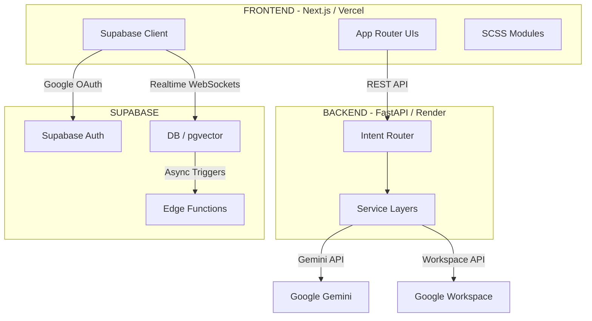

# SPEC.md

## 1. Overview

**CSIS SmartAssist** is a production-grade, full-stack, AI-powered departmental platform architected for the **Computer Science & Information Systems (CSIS) Department at BITS Pilani, K K Birla Goa Campus**.

The application serves a dual purpose: providing students and faculty with immediate, context-aware access to institutional knowledge (syllabi, policies, prerequisites) through an advanced Retrieval-Augmented Generation (RAG) system, and automating classroom/laboratory reservations via a structured, admin-approved calendar allocation workflow.

---

## 2. Architecture & System Topology

The platform utilizes a clean, decoupled client-server architecture. All core infrastructure components are selected to remain entirely cost-free while bypassing typical free-tier resource limitations.



---

## 3. Component Deep Dive

### 3.1. Auth & Profile System (Supabase Native)

The application utilizes native **Supabase Auth**, eliminating redundant backend synchronization endpoints.

* **Native OIDC Flow:** To maintain the official Google Consent Screen branding without relying on heavy third-party libraries, the app uses a custom OpenID Connect (OIDC) implicit flow. It securely hashes a locally generated nonce to negotiate an `id_token` from Google, which is then cryptographically verified by Supabase.
* **Secure Multi-Tier Guardrail:** Google OAuth is restricted at the database layer. A Postgres trigger on `auth.users` evaluates incoming metadata, raising an uncatchable exception for any email domain failing to match the official campus suffix (`@goa.bits-pilani.ac.in`).
* **Onboarding Orchestration:** New sessions without an established profile record are cleanly intercepted via Next.js parallel/conditional routing and directed to a non-dismissible `/onboarding` module. This layout aggregates critical data points—Academic Role, specialized tracks, and technical interests.

### 3.2. Multi-Page Architecture & Sitemap

```text
/ (Landing Page)
 └── Public Access | 3D Polyhedron Animation + Google OAuth Entry

/onboarding
 └── Auth Required | Intercepts new users. Captures Dept, Year, and Interests.

/chat
 └── Auth Required | Core Interface
     ├── Sidebar: Chat Session History & Management
     └── Main: Active Chat Window with Intent-Routed Responses

/bookings
 └── Auth Required | User Dashboard
     └── List of user's personal booking requests and live status (Pending/Approved)

/profile
 └── Auth Required | Personalization Context
     └── User settings, active academic context, and synthesized session memory

/admin
 └── Admin Only    | Department Management
     ├── Booking Approval Matrix
     └── RAG Pipeline Dashboard (Sync Status & Knowledge Base Mgmt)
```

### 3.3. Automated Client-Led RAG Pipeline

To prevent out-of-memory ($O(N)$ RAM) exceptions on isolated free hosting tiers (e.g., 512MB restrictions), text extraction, chunking, and storage pipelines are re-engineered using a **Client-Led Decentralized Loop**.

* **State Tracking via Cryptographic Hashes:** The backend compares live Google Drive resource objects against the relational database via `md5_checksum` attributes. The calculated delta accurately returns clean operation sets: `New`, `Modified`, or `Deleted`.
* **Decoupled Vector Management:** Local disk vector databases are fully deprecated. The platform relies exclusively on the cloud-hosted Supabase `pgvector` extension.
* **Relational Schema Mapping:**
  * `rag_files`: Tracks structural source metadata (`id`, `gdrive_id`, `name`, `mime_type`, `md5_checksum`, `updated_at`).
  * `rag_chunks`: Holds structural segment contents (`id`, `file_id`, `content`, and `embedding vector(768)`).

### 3.4. Intent Routing & Failsafe Resolution Engine

The primary entry layer utilizes a **Three-Way Intent Classifier Prompt** parsed via Gemini to ensure the platform handles edge requests gracefully:

1. **`department_query`**: Prompts referencing institutional details. Fires the Supabase `pgvector` retrieval loop.
2. **`calendar_query`**: Requests indicating space reservations or timing. Activates calendar workflows.
3. **`general_query`**: Academic, foundational computer science, or generic programming questions. The system bypasses RAG entirely, executing an unconstrained LLM pass.

### 3.5. Space Reservation Engine (Google Calendar Matrix)

* **Resource Management:** Individual labs, lecture halls, and meeting zones are defined via distinct secondary calendars managed under a unified Workspace Service Account.
* **FreeBusy Resolution:** Structural space queries utilize the Google Calendar `FreeBusy` API array matrix. The engine parses availability across all room variants simultaneously in a single round-trip.
* **Concurrent Locking:** In-memory locking mechanisms (`cachetools.TTLCache`) and optimistic database concurrency prevent double-bookings during the proposal phase.

### 3.6. Message Architecture & Realtime State Memory

* **Episodic Memory Synthesis:** When a conversation session completes or shifts, an asynchronous database hook triggers a **Supabase Edge Function**. This layer synthesizes critical long-term facts and appends them to a running `synthesized_memory` attribute.
* **State Separation for Interactive Actions:** To eliminate UI rendering synchronization bugs, chat content maps strict layout schemas (`content` for text, `interactive_type` for components, `interactive_payload` for data).
* **Realtime Interactivity:** UI components validate target states reactively via **Supabase Realtime WebSockets**.

### 3.7. Communication Framework
* **Gmail API Integration:** Outbound notifications utilize the standard HTTPS Gmail API via a centralized Google Service Account.
* **HTML Email Templating:** Structural email designs are constructed server-side in Python to maintain the app's utilitarian aesthetic without requiring heavy dependencies like React Email.

---

## 4. Engineering Standards & Testing

The repository maintains strict open-source engineering standards, backed by comprehensive automated test suites.

### 4.1. Code Formatting & Linting
* **Backend:** Enforces static typing, unused-import removal, and PEP-8 compliance via `ruff` and `flake8`.
* **Frontend:** Maintains strictly typed React modules and SCSS integrations validated via `tsc` (TypeScript compiler) and `eslint`.

### 4.2. Testing Suites (>80% Coverage)
* **Frontend (Vitest & React Testing Library):**
  * `ui/__tests__/`: Contains 65+ unit and integration tests.
  * Ensures custom hooks (`useAuth`, `useBookings`) handle async states, mocking Supabase clients correctly to test unauthenticated vs. authenticated workflows.
  * API endpoints (`ui/lib/api.ts`) are tested extensively, including mocking Server-Sent Events (SSE) streaming resolution.
* **Backend (Pytest):**
  * `api/tests/`: Contains 35+ exhaustive tests encompassing RAG logic, Gemini API fallbacks, Gmail API integrations, and robust SQLite isolation.
  * FastAPI `TestClient` is used to trigger end-to-end intent resolution scenarios, including complex edge cases like concurrency locks on calendar resources.

---

## 5. Visual Layout & Typography Principles

The styling philosophy completely avoids generic framework elements, implementing tailored layouts using scoped **CSS Modules and SCSS** for fast load speeds and strict presentation control.

### 5.1 Typography & Chat Formatting System
* **Headings & Accents (`Space Grotesk`):** Sharp, geometric, technical aesthetic.
* **Body Text & UI (`Inter`):** Maximum readability across all screen sizes.
* **Technical / Code (`JetBrains Mono`):** Dedicated monospace font for inline code.
* **Rich Chat Formatting (Markdown):** Executed client-side utilizing `react-markdown` alongside the `remark-gfm` plugin.

---

## 6. Directory Blueprint (Minimalist & Clean Layout)

```
.
├── api/                  # FastAPI Application Layer
│   ├── core/             # Infrastructure Config, DB Drivers, Prompts
│   ├── routes/           # Endpoint Controllers (chat.py, booking.py, rag.py)
│   ├── services/         # Third-Party API Integrations
│   │   ├── llm/          # base.py, hybrid.py, openai.py, gemini.py
│   │   ├── calendar.py   # Workspace Calendar logic
│   │   └── gmail.py      # Workspace Gmail logic
│   ├── tests/            # Pytest Suite
│   └── main.py           # Clean Bootstrapper & Middleware Registry
├── ui/                   # Next.js Application Layer
│   ├── app/              # App Router File-System Routing Groupings
│   ├── components/       # Atomic UI Components (ChatBubble, BookingCard)
│   ├── styles/           # SCSS Mixins, Global Variables, Shared Layouts
│   ├── lib/              # Client API Handlers, State Utilities, Hooks
│   └── __tests__/        # Vitest Suite
├── docs/                 # Documentation Repository
│   ├── SPEC.md           # Engineering Specification Matrix
│   └── SETUP.md          # Local Setup & Environments
├── .env.example          # Standard Environmental Configurations
└── docker-compose.yml    # Unified Local Database Test Container Environment
```
